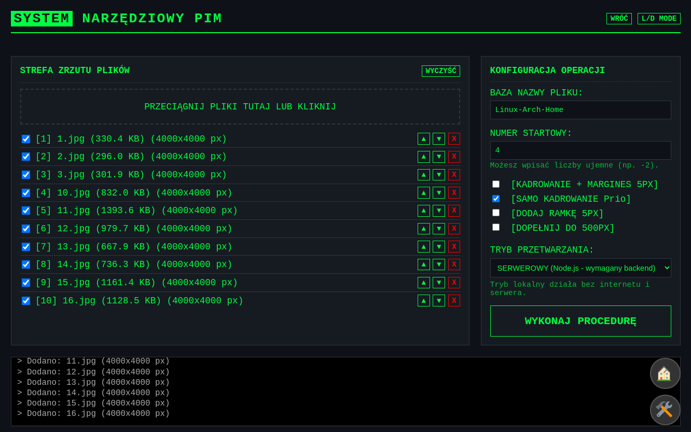

# Webp/JPEG/AVIF Image Processor

<div align="center">

[](https://lucasterg.github.io/webp-jpeg-www/tools.html)

</div>

Wszechstronne narzędzie do przetwarzania obrazów, stworzone z myślą o szybkich konwersjach i przygotowywaniu plików zgodnie z konkretnymi standardami (Media Expert). Pozwala na szybką zmianę formatów, inteligentne kadrowanie oraz precyzyjne zarządzanie nazewnictwem plików.

## ✨ Główne Funkcje

-   **Wsparcie wielu formatów:** Obsługa plików WebP, JPEG, PNG, AVIF, GIF oraz TIFF.
-   **Inteligentne Kadrowanie i Dopełnianie:**
    -   Automatyczne **kadrowanie do zawartości**, usuwające jednolite obramowanie/tło.
    -   Wykrywanie białego lub przezroczystego tła – jeśli występuje, dodaje bezpieczny margines 5px.
    -   Dopełnianie (białym tłem) małych zdjęć do minimum 500px.
-   **Sanityzacja Nazw Plików:** Zaawansowana logika zamiany polskich znaków (np. ą -> a), usuwania znaków specjalnych i czyszczenia nazwy.
-   **Przetwarzanie wsadowe:** Możliwość wrzucenia wielu plików naraz.
-   **Tryb Hybrydowy:** Unikalna architektura pozwalająca na pracę w dwóch trybach:
    -   **Lokalny (Client-Side):** Przetwarzanie odbywa się w całości w Twojej przeglądarce. Nie wymaga serwera, działa offline i na darmowych hostingach (np. GitHub Pages).
    -   **Serwerowy (Node.js):** Wykorzystuje moc backendu i biblioteki `sharp` dla maksymalnej wydajności przy bardzo dużych plikach.
-   **Pobieranie jako ZIP:** Wszystkie przetworzone pliki są pakowane w jedno archiwum gotowe do pobrania.

## 🚀 Dwa tryby pracy

Aplikacja oferuje dwa interfejsy, w zależności od potrzeb:

### 1. Szybka Konwersja (Strona Główna)
Idealna do błyskawicznych zadań. Wrzucasz pliki, podajesz bazową nazwę (np. ze schowka) i otrzymujesz gotowe JPEGi. Bez zbędnych ustawień.

### 2. Zaawansowane Narzędzia (Tools)
Dla zadań wymagających precyzji. Oferuje "hakerski", ciemny interfejs (z opcją Light Mode) i pozwala na:
*   **Wybór silnika przetwarzania:** Przełącznik między trybem **LOKALNYM** (domyślny, działa w przeglądarce) a **SERWEROWYM** (wymaga uruchomionego backendu Node.js).
*   **Zarządzanie kolejnością:** Przesuwanie plików w górę/dół na liście przed wysłaniem.
*   **Niestandardowa numeracja:** Możesz zacząć numerowanie plików od dowolnej liczby (nawet ujemnej, np. -2, -1, 0...).
*   **Podgląd opcji:** Włączanie/wyłączanie kadrowania i skalowania do 500px.
*   **Szybkie nazewnictwo:** Pole nazwy obsługuje automatyczne wklejanie i czyszczenie tekstu ze schowka po najechaniu myszką.

Zobacz jak to działa w praktyce:



## 🛠️ Uruchomienie projektu

### Wymagania

*   [Node.js (wersja LTS)](https://nodejs.org/en/download)
*   npm

### Instalacja

1.  Sklonuj repozytorium:
    ```bash
    git clone https://github.com/LucasTerg/webp-jpeg-www.git
    cd webp-jpeg-www
    ```
    [Pobierz repozytorium w pliku .zip](https://github.com/LucasTerg/webp-jpeg-www/archive/refs/heads/main.zip)

2.  Zainstaluj zależności:
    ```bash
    npm install
    ```

### Uruchomienie (Tryb Deweloperski)

1.  Uruchom serwer (frontend + backend):
    ```bash
    npm run dev
    ```
2.  Otwórz przeglądarkę pod adresem (zazwyczaj):
    *   **Strona Główna:** `http://localhost:5173/`
    *   **Narzędzia (Tools):** `http://localhost:5173/tools.html`

## 🤝 Licencja

Projekt udostępniony na licencji LGPL-3.0-or-later.